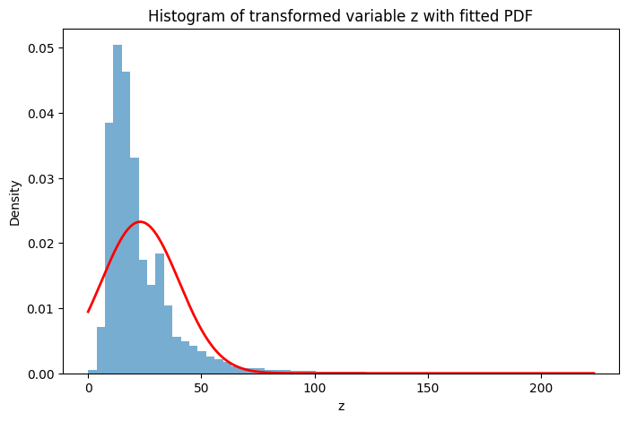
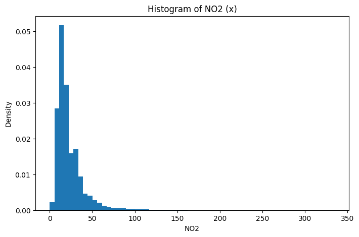

# Probability Density Estimation via Roll-Dependent Nonlinear Mapping

**Course:** UCS654 – Predictive Analytics using Statistics  
**Assignment:** Advanced Mathematics – Assignment 3  
**Student:** Raj Gupta  
**Roll No.:** 102303324 

---

## Overview

This project investigates probabilistic modeling of air pollution measurements using a nonlinear transformation determined by the student’s roll number.

Nitrogen Dioxide (NO₂) readings from the India Air Quality dataset are transformed using a sinusoidal perturbation. Statistical parameters are then estimated from the transformed data to fit a Gaussian-type probability density function (PDF).

---

## Objectives

- Implement a roll-number-driven nonlinear transformation  
- Compute statistical estimates from transformed observations  
- Model the distribution using a Gaussian-type PDF  
- Evaluate agreement between empirical data and theoretical density  

The fitted density has the form:

p̂(z) = c · e^(−λ (z − μ)²)

---

## Dataset

- **Dataset:** India Air Quality Data  
- **Feature Used:** NO₂ concentration  
- **Source:**  
  https://www.kaggle.com/datasets/shrutibhargava94/india-air-quality-data  

---

## Methodology

### 1. Roll-Based Nonlinear Transformation

Each original observation \(x\) is mapped to a new variable \(z\) using:

$$
z = x + a_r \sin(b_r x)
$$

where the roll-number-dependent constants are defined as:

$$
a_r = 0.05 (r \bmod 7)
$$

$$
b_r = 0.3 (r \bmod 5 + 1)
$$

For roll number **102303324**, the computed values are:

| Parameter | Value |
|-----------|--------|
| \(a_r\) | 0.2 |
| \(b_r\) | 1.5 |

---

### 2. Parameter Estimation

After removing missing values and computing statistics from the transformed variable \(z\), the following estimates were obtained:

| Parameter | Estimated Value |
|-----------|-----------------|
| Mean \( \mu \) | 23.00611965469464 |
| Shape \( \lambda \) | 0.0017013858710854023 |
| Normalizing constant \( c \) | 0.02327161238461796 |

The parameters are derived using:

$$
\lambda = \frac{1}{2\sigma^2}
$$

$$
c = \sqrt{\frac{\lambda}{\pi}}
$$

---

## Graphical Analysis

### Histogram of Original NO₂ Data

The original NO₂ measurements exhibit positive skewness, with most observations concentrated at lower values and a noticeable right tail.

---

### Histogram of Transformed Data with Fitted PDF

After the nonlinear transformation, the distribution appears smoother. The fitted Gaussian-type curve aligns well with the central region of the empirical histogram, indicating effective parameter estimation.

---

## Final Estimated Density Function

p̂(z) = 0.02327161238461796 · e^(−0.0017013858710854023 (z − 23.00611965469464)²)

---

## Conclusion

The roll-number-dependent nonlinear transformation provides a structured method to modify real-world environmental data prior to probabilistic modeling.

Using statistical estimation techniques, the parameters of a Gaussian-type distribution were successfully learned from the transformed NO₂ dataset. The graphical comparison between empirical data and the theoretical density function indicates that the model provides a reasonable approximation of the transformed distribution.